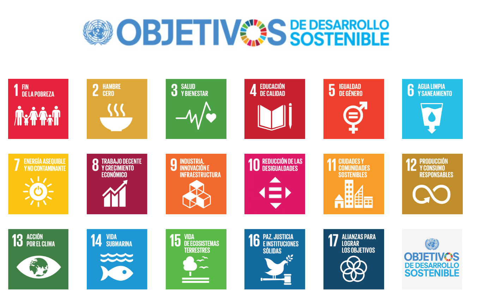

# Introducción a la Sostenibilidad

## ¿Qué es la sostenibilidad?

La sostenibilidad es el poder cubrir las necesidades que tenemos actualmente sin perjudicar las posibilidades de las futuras generaciones para poder hacer lo mismo.

## Las tres dimensiones de la sostenibilidad

La sostenibilidad se logra gracias a tres pilares: el económico, el social y el ambiental

- Sostenibilidad económica: Busca un crecimiento que sea financieramente viable y que no genere un impacto negativo en el medio ambiente o la sociedad.

- Sostenibilidad social: Consiste en asegurar la equidad, la justicia social y la calidad de vida para todas las personas, garantizando el acceso a servicios básicos, promoviendo la inclusión y reduciendo las desigualdades.

- Sostenibilidad ambiental: Se enfoca en la conservación de los ecosistemas y la biodiversidad, utilizando los recursos naturales de forma responsable para que no se agoten. 

## Autor involucrado con la sostenibilidad

> Jane Goodall: "Lo que hagamos hoy afecta a las generaciones futuras".

## ODS relacionados con la informática

| ODS | Nombre | Relación con la informática |
|-----|---------|------------------------------|
| 4 | Educación de calidad | Uso de tecnologías digitales para mejorar el acceso a la educación. |
| 9 | Industria, innovación e infraestructura | Desarrollo de infraestructuras tecnológicas sostenibles e innovadoras. |
| 12 | Producción y consumo responsables | Promoción del reciclaje y del uso eficiente de equipos informáticos. |

## Todos los ODS propuestos

## Acciones sostenibles en informática
* [x] Apagar los equipos cuando no se estén usando.  
* [x] Reciclar dispositivos electrónicos de forma adecuada.  
* [ ] Utilizar servicios en la nube con baja huella de carbono.  
* [ ] Fomentar el teletrabajo para reducir desplazamientos.  
* [x] Promover el uso de software libre y eficiente.  
* [x] Mantener los equipos actualizados para alargar su vida útil.
